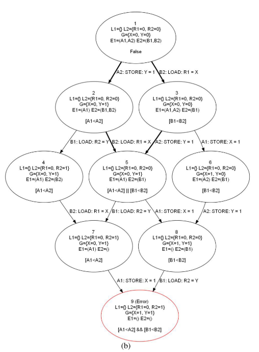

# Automatic Inference of Memory Fences

# the algorithm for memory fence inference

## the example:
consider the following programming states and program

`R1 = R2 = X  = Y  = 0`

The AB parallel program
```txt
    A:
A1: STORE 1,X
A2: STORE 1,Y
```

```txt
    B:
B1: STORE 1,R1
B2: STORE 1,R2
```

Then the pratial **transition system** is as the picture




Where each **circle is a state**

The state is defined to contain:
1. assignments of values to local and global variables; 
2. per-process execution buffer containing events that will eventually occur (for instance memory events or instructions waiting to be executed)

**Avoidable transition:** is *a transition taken by the program that could have been prohibited by some fence.* 

In this example, the black lines are the avoidable transitions, where out of order happends.

### **Formally**

The **transition system** is a tuple $\langle \Sigma _{P} , T_{P}  \rangle$, these are set of states and labeled transitions $\sigma \xrightarrow{l} \sigma '$

**dynamic program order**

$$
l_{1} <_{\sigma ,p} l_{2} 
$$

this means that the $l_{1}$ precedes $l_{2}$ in-order 


Thus a transition $t = \sigma \xrightarrow{l_t} \sigma '$ is **avoidable** if exists some $l_{1}$ such that $l_{1} <_{\sigma ,p} l_{t}$

> 这个的理解就是想要某一个转换不发生，那就加个fence让它随便发生一个别的

thus
$$
\text{prevent}(t) = \bigvee\left\{\left[l_{1} \prec l_{t}\right] | l_{1}<_{\sigma, p} l_{t}\right\}
$$

后面的inference 伪代码，本质就是不断地迭代更新 $\text{avoid}(u)$和 $\text{prevent}(t)$

> 注意这二者的差别是一个是让某个状态不发生，一个是让某个transition不发生

# TODOs:

What is the semantics for getting this transition system? It got to have some semantics, otherwise how to deal with `if then else`

Look at all these memory models